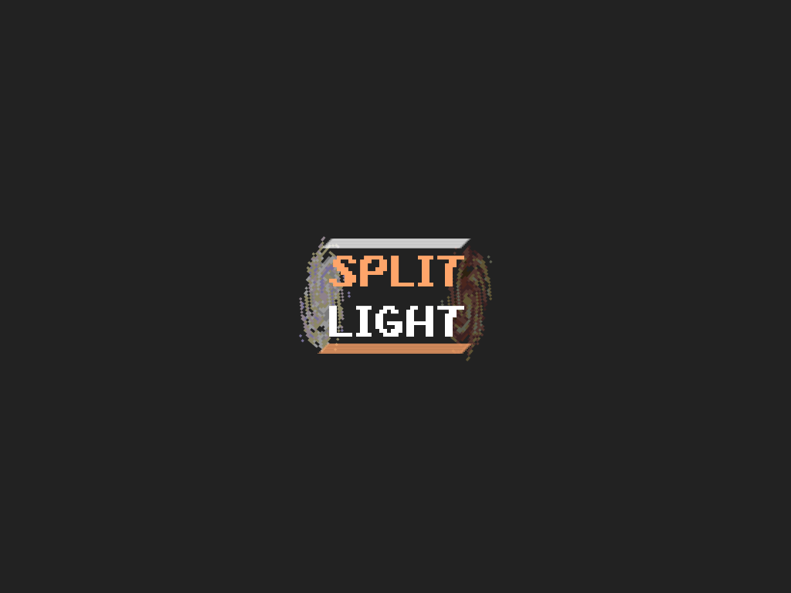
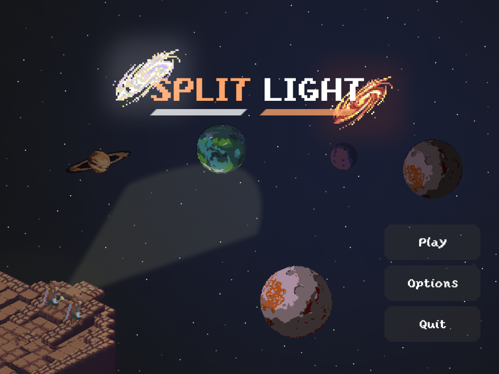

# Split-Light

> Split Light is an Escape Room-style game where two characters with unique abilities are capable of solving puzzles of different natures.

## Developers

- Meng Fei Dai
- Félix Miguel Velásquez
- Daniel Gutiérrez Recio
- Mario García Abellán
- Juan Carlos Rodríguez Ramírez
- Ian Samuel Trujillo Gil

## Table of Contents

- [Description](#description)
- [Design Boards](#design-boards)
- [Project Board](#project-board)
- [Tech Stack](#tech-stack)
- [Screenshots](#screenshots)
- [Acknowledgements](#acknowledgements)

## Description

Split Light is an Escape Room-style game in which two players possess unique characteristics that will be key to solving challenging puzzles within a maximum time limit.

Navigate the Split Light universe, jumping between diverse planets with unique themes alongside creative, challenging puzzles that require thinking outside the box.

## Design Boards

Here you can find all designs and mockups made so far, from complete screens to individual elements.

- [Initial screen and various components](https://www.figma.com/design/VT0UKK87N6LZgI05aA2SI9/Vistas---Split-Light?node-id=0-1&t=OkTcRE2eOXmAB1ab-1)

## Project Board

Here you can find the complete task log to date, with all pending features to develop, those in progress, and those ready for production.

[Project Board on Trello](https://trello.com/b/3kcMWzsV/split-light)

## Tech Stack

This project is based on [Godot 4.4](https://godotengine.org/), a game engine with extensive capabilities for 2D games and broad support for 3D.

Godot has its own programming language (GDScript), which is easy to learn, with a low learning curve, and capable of providing a fast workflow in a short time.

## Screenshots

As game development progresses, we will add more game screenshots.

## Acknowledgements

- Planet Generation: [PixelPlanets](https://deep-fold.itch.io/pixel-planet-generator)
- Godot Game Engine: [Godot](https://godotengine.org/)
- Isometric TileSets: [Isometric TileSets](https://scrabling.itch.io/pixel-isometric-tiles)